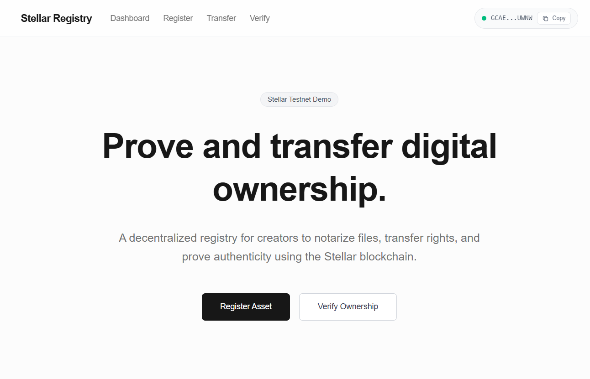

Stellar Asset Registry
Blockchain-Based Digital Ownership & Verification

A Web3 application built on the Stellar Testnet that lets creators secure, transfer, and publicly verify ownership of digital files using cryptographic proofs recorded on blockchain.

Designed for real-world use cases like certificates, creative work, contracts, and digital collectibles — fast, transparent, and trustless.

## Demo
[Watch Demo Video](https://drive.google.com/file/d/1AY2dYAcFIYuClupk-apw7B1k2p26Pm_8/view?usp=sharing)

Features
Connect multiple wallets (Freighter, Albedo, xBull, Rabet)
Local SHA-256 hashing (files never uploaded)
Permanent blockchain ownership record
Secure ownership transfer via Claimable Balances
Public verification using Asset ID or file hash
Downloadable ownership certificate & transaction receipt (PDF)

Workflow
File fingerprint generated locally
Ownership recorded on Stellar
Metadata indexed for fast lookup
Ownership transferable to any address
Anyone can verify authenticity instantly

Tech Stack
Frontend: Next.js 14, TailwindCSS, Zustand
Blockchain: Stellar SDK, Horizon API
Database: Firebase Firestore
Security: Non-custodial, client-side signing

Setup
git clone https://github.com/anuraggdubey/asset-registry.git
cd asset-registry
npm install
npm run dev

Open http://localhost:3000

Screenshots:
### Home Page

### Tests Passed

License:
MIT

Author 
~Anurag Dubey