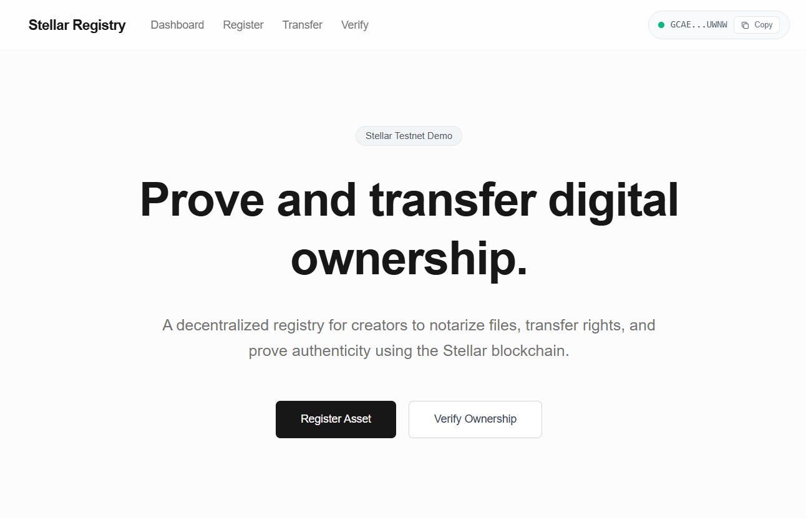
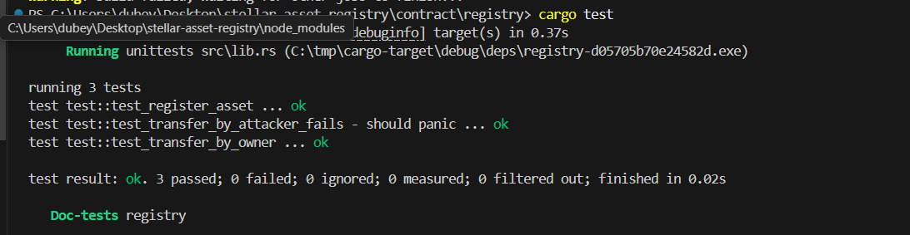

# Stellar Asset Registry

<p align="center">
  <b>Blockchain-Based Digital Ownership and Verification on Stellar Testnet</b>
</p>

<p align="center">
  
  
  
  
  
</p>

<p align="center">
  A Web3 application that lets creators <b>register</b>, <b>transfer</b>, and <b>verify</b> digital asset ownership
  using a Soroban smart contract backed by an indexed metadata registry.
</p>

---

## Overview

This project is built for digital certificates, creative work, contracts, collectibles, and any asset where ownership should be tied to a cryptographic fingerprint and a wallet address.

The browser computes a SHA-256 fingerprint locally, the Soroban contract stores the ownership state on-chain, and Firebase indexes metadata for fast lookup by registry ID or hash.

## Demo

[Watch Demo Video](https://drive.google.com/file/d/1AY2dYAcFIYuClupk-apw7B1k2p26Pm_8/view?usp=sharing)

## Live Contract

> Stellar Testnet Soroban Contract  
> `CCZB3U3LS7PGIPGGPUQ5HP4TEUH4CYFQQ7JEBWRVNXRLSIWS6RMGNDAV`

## Features

- Connect multiple Stellar wallets
- Generate SHA-256 file fingerprints locally in the browser
- Register ownership through a Soroban smart contract
- Transfer ownership through the same Soroban contract
- Verify current owner directly from on-chain contract state
- Sync registry metadata into Firebase for fast search and dashboard views
- Generate downloadable ownership and transfer certificates

## Architecture

### Source of Truth
- Soroban smart contract is the ownership authority
- Firebase is the metadata index and cache layer

### Contract Functions
- `register(id, owner)`
- `transfer(id, to)`
- `owner(id)`

### Ownership Flow
1. A file is hashed locally with SHA-256.
2. A registry record is created in Firebase.
3. The Soroban contract stores ownership for that hash.
4. Registry sync updates the cached owner from contract state.
5. Verification compares cached data with the live contract owner.

## Tech Stack

- Frontend: Next.js 16, React 19, TailwindCSS, Zustand
- Blockchain Client: `@stellar/stellar-sdk`
- Smart Contracts: Soroban on Stellar Testnet
- Contract Language: Rust with `soroban-sdk`
- RPC Layer: Soroban RPC
- Database: Firebase Firestore
- Wallet Signing: `@creit.tech/stellar-wallets-kit`

## Setup

```bash
git clone https://github.com/anuraggdubey/asset-registry.git
cd asset-registry
npm install
npm run dev
```

Open:

```bash
http://localhost:3000
```

## Environment

Required configuration includes:

- `NEXT_PUBLIC_STELLAR_RPC_URL`
- `NEXT_PUBLIC_STELLAR_REGISTRY_CONTRACT_ID`
- Firebase server credentials
- Firebase client credentials

The current local setup already points to Stellar Testnet Soroban RPC and the deployed registry contract through [.env.local](/c:/Projects/stellar-asset-registry/.env.local).

## Contract Development

Build the contract:

```bash
cd contract/registry
stellar contract build
```

Run contract tests:

```bash
cargo test
```

Deploy to testnet:

```bash
stellar contract deploy --network testnet --source <identity> --wasm <path-to-wasm>
```

## Verification

App checks:

- `npm test`
- `npm run build`

Contract checks:

- `cargo test`

## Screenshots

### Home Page



### Tests Passed



## License

MIT

## Author

Anurag Dubey
